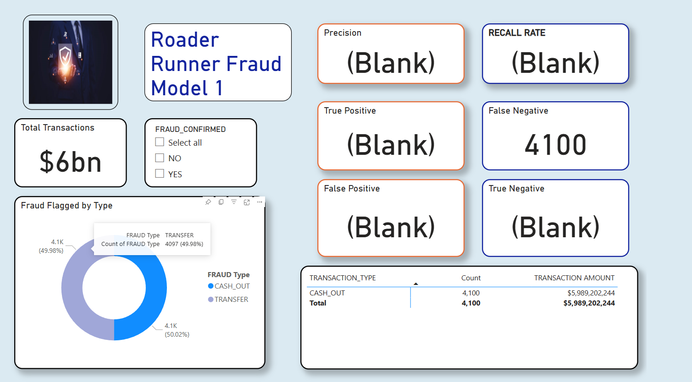
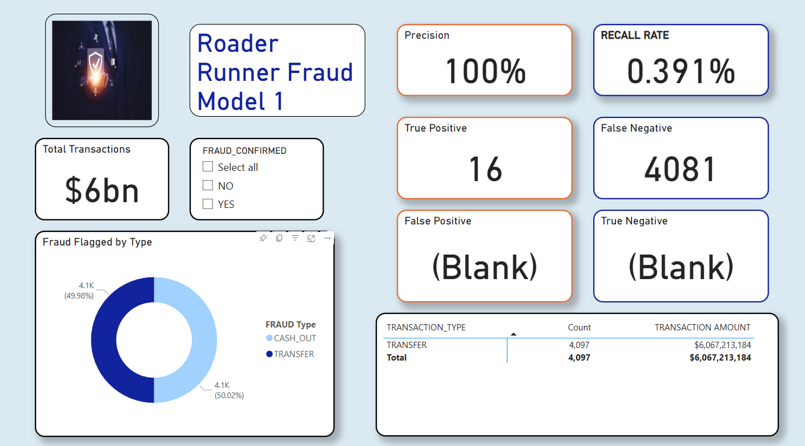
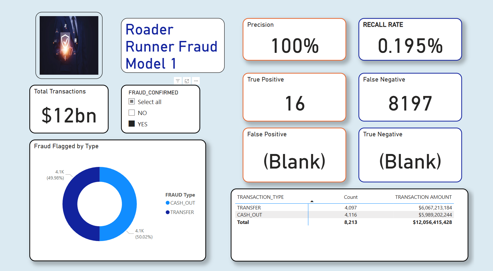

# Power  Bi 
)

### Task 

* Import the dataset into Power BI
* Transform the data for optimal analysis
* Create new columns to enhance insights
* Update field Types for accuracy
* Establish naming conventions for the applied steps
* Create measures to perform calculations
* Render report to visualize findings

## Dataset Overview

This dataset is provided for educational and illustrative purposes, designed specifically for financial fraud detection through predictive analysis to identify fraudulent transactions.

# Key Features

* Purpose: To perform predictive analysis and detect fraudulent transactions within a financial system.
* Dataset Size: Contains over 6 million transactions, covering various transaction types, including CASH-IN, CASH-OUT, DEBIT, PAYMENT, and TRANSFER.

# Report Insights

* The report evaluates the performance of the predictive model using a confusion matrix, which highlights the model’s accuracy in identifying and correctly flagging fraudulent transactions.
* The analysis focuses on key metrics like true positives, false positives, false negatives, and true negatives, essential for understanding the model's precision and reliability.

## Conclusion

Despite achieving a precision of 100% in predicting fraud, the model's recall rate was notably low at 0.391%, correctly identifying only 16 confirmed fraudulent transactions in the Transfer category, while producing 4,081 false negatives. This discrepancy highlights the model's limitations in recall for accurately predicting and flagging fraudulent transactions. Overall, the model’s recall rate was 0.195%, with 8,197 false negatives. This limitation in recall significantly affects cost-benefit analysis by increasing the likelihood of missing fraudulent transactions, resulting in missed opportunities and potential financial losses.

###

## Evidentially AI

To learn more about the confusion matrix for Machine learning models:

Confusion Matrix: https://www.evidentlyai.com/classification-metrics/confusion-matrix#:~:text=A%20confusion%20matrix%20is%20a%20table

## Financial Fraud Detection Dataset

To learn more about the Data Set visit: 
https://www.kaggle.com/datasets/sriharshaeedala/financial-fraud-detection-dataset

