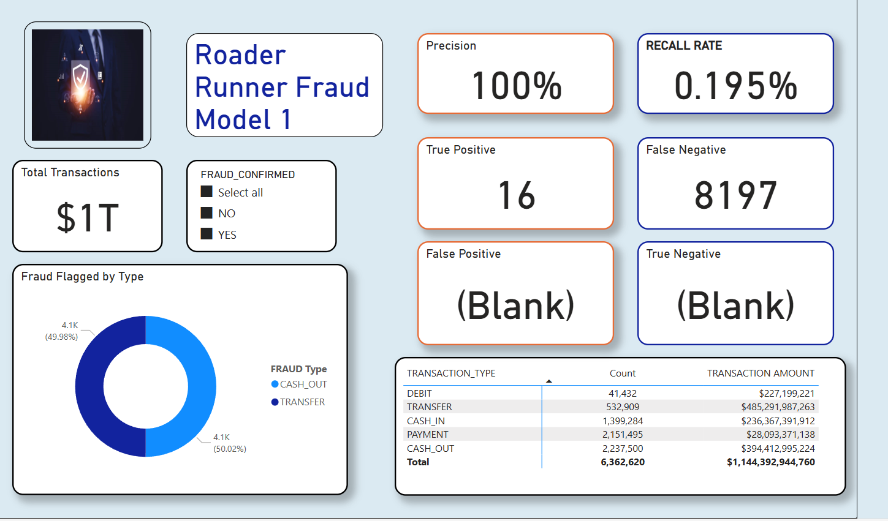

# Power  Bi 

### Task 

* Import Data Set to Power Bi 
* Transform Data
* Create New Columns
* Update Field Types 
* Update Applied Step Naming Conventions
* Create Measures 
* Render Report 

* 

* 

## Considerations

* The Data set is a practice data set that allows users to create or test models for Financial Fraud Detections and for illustrative purposes only.
* I used this data aset to demostrate fraud analysis and how to interpret a confusion matrix for flagging fraud and testing the predication outcomes.
* The dataset contained more than 6 million transactions.  

## Evidentially AI

To learn more about the confusion matrix for Machine learning models:

Confusion Matrix: https://www.evidentlyai.com/classification-metrics/confusion-matrix#:~:text=A%20confusion%20matrix%20is%20a%20table

## Financial Fraud Detection Dataset

To learn more about the Data Set visit: 
https://www.kaggle.com/datasets/sriharshaeedala/financial-fraud-detection-dataset

